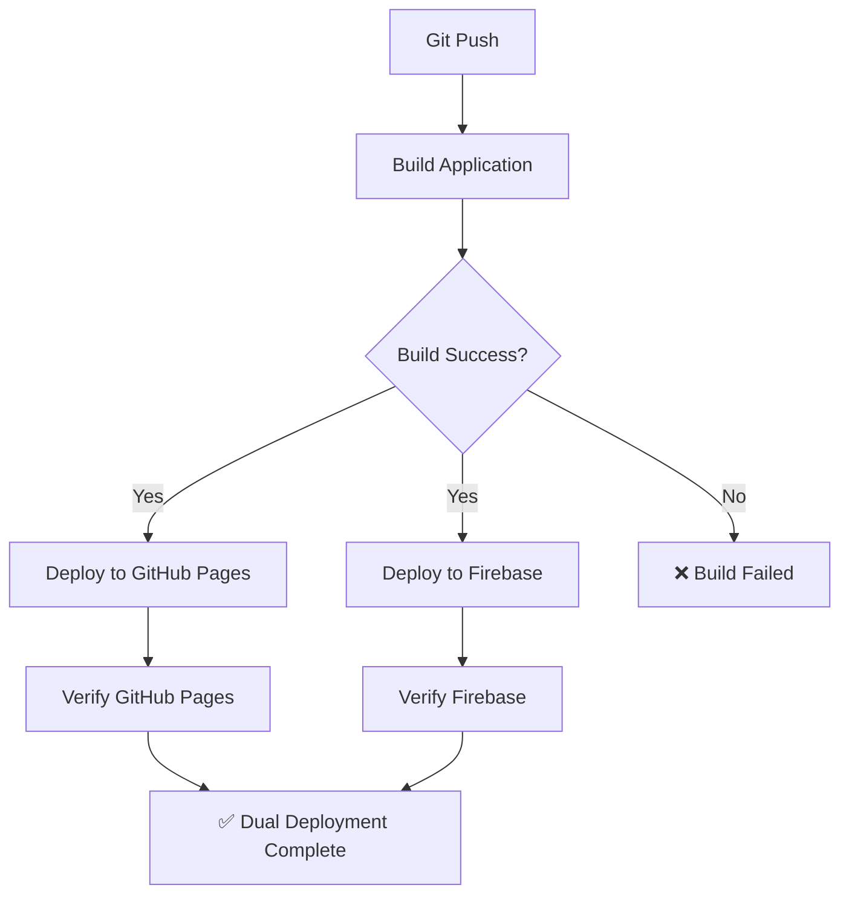

# 🔐 TURSAKUR Deployment Secrets Configuration

Bu dosya, TURSAKUR projesinin dual deployment (Firebase + GitHub Pages) için gerekli GitHub Secrets yapılandırmasını açıklar.

## 🔑 Gerekli GitHub Secrets

### Firebase Deployment İçin:

1. **`FIREBASE_TOKEN`**
   ```bash
   # Firebase CLI ile token oluştur:
   firebase login:ci
   ```
   - Bu komut size bir token verecek
   - Bu token'ı GitHub Repository > Settings > Secrets and variables > Actions > Repository secrets'a ekleyin

2. **`FIREBASE_PROJECT_ID`** (Opsiyonel)
   ```
   tursakur-project
   ```
   - Firebase proje ID'nizi ekleyin
   - firebase.json'da tanımlı değilse gerekli

## 🚀 Deployment URL'leri

### 🔥 Firebase Hosting (Ana Site)
- **Production URL**: https://tursakur.web.app
- **Performance**: Ultra-fast global CDN
- **Cache**: Optimize edilmiş cache stratejileri
- **Analytics**: Firebase Analytics entegrasyonu

### 📚 GitHub Pages (Yedek Site)  
- **Backup URL**: https://mahirkurt.github.io/TURSAKUR/
- **Reliability**: %100 uptime garantisi
- **CI/CD**: Automated GitHub Actions
- **Cost**: Tamamen ücretsiz

## ⚙️ Deployment Workflow



## 🔧 Setup Instructions

### 1. Firebase CLI Setup (Local)
```bash
npm install -g firebase-tools
firebase login
firebase init hosting
```

### 2. GitHub Secrets Setup
1. Firebase'de proje oluşturun: https://console.firebase.google.com
2. Terminal'de: `firebase login:ci`
3. Token'ı kopyalayın
4. GitHub Repository > Settings > Secrets and variables > Actions
5. "New repository secret" > `FIREBASE_TOKEN` > Token'ı yapıştırın

### 3. Test Deployment
```bash
# Local test
python build.py
firebase deploy --only hosting

# GitHub Actions trigger
git push origin main
```

## 📊 Monitoring

### Deployment Status
- **GitHub Actions**: https://github.com/mahirkurt/TURSAKUR/actions
- **Firebase Console**: https://console.firebase.google.com
- **GitHub Pages**: Repository > Settings > Pages

### Performance Monitoring
- **Firebase Performance**: Console > Performance
- **Google Analytics**: Firebase Analytics dashboard
- **Lighthouse**: Automated performance testing

## 🛠️ Troubleshooting

### Firebase Deployment Fails
```bash
# Check Firebase token
firebase projects:list

# Re-authenticate
firebase login:ci

# Manual deploy
firebase deploy --debug
```

### GitHub Pages Deployment Fails
```bash
# Check GitHub Actions logs
# Verify build artifacts
# Check repository permissions
```

## 🎯 Best Practices

1. **Primary Site**: Firebase (performance)
2. **Backup Site**: GitHub Pages (reliability) 
3. **Development**: Local + GitHub Pages
4. **Production**: Firebase Hosting
5. **Monitoring**: Both platforms simultaneously

---

**🌟 TURSAKUR v2.0.3 - Dual Deployment Ready!**
